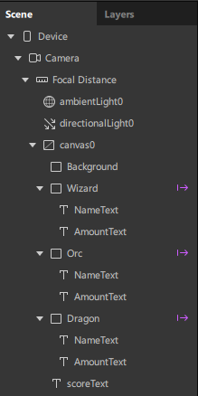
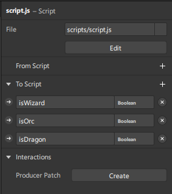
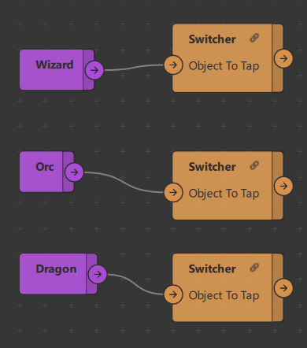
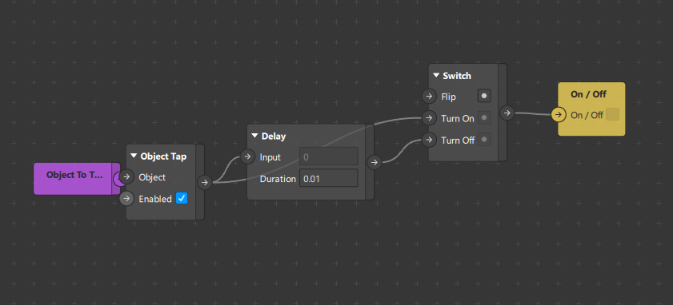
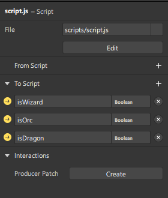
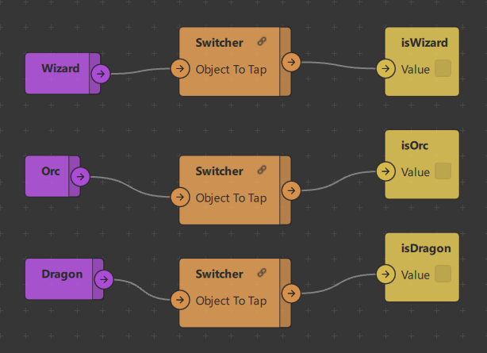

<a name="readme-top"></a>
<h3 align="center">Score Counter for Spark AR</h3>

<!-- PROJECT LOGO -->
<div align="center">

<p align="center">
Easily add scores in Spark AR!
</p>
</div>
<hr>

<!-- TABLE OF CONTENTS -->
<details>
  <summary>Table of Contents</summary>
  <ol>
    <li><a href="#about">About</a></li>
    <li><a href="#version-notes">Version Notes</a></li>
    <li><a href="#functions">Functions</a></li>
    <li><a href="#setup">Setup</a></li>
    <li><a href="#example">Example</a></li>
    <li><a href="#contact">Contact</a></li>
  </ol>
</details>

<!-- ABOUT THE PROJECT -->
## About


</br>
Having trouble adding score to your Spark AR game?
</br>
This [code](#code) is here just to do that.

## Version Notes
* This effect is created using Spark AR v147.

<!-- FUNCTIONS -->
## Functions
* Add scores in Spark AR using script.

<!-- SETUP -->
## Setup

* Open Spark AR and add 3 <strong>Rectangles</strong> to the scene.
* Name the rectangles to <strong>Wizard, Orc & Dragon</strong>.
* Add a 2D Text to assign a name to each rectangles as their children.

<div align="center">

</div>

* Add a <strong>2D Text</strong> and name it to scoreText.

* Try to arrange the Rectangles and Text to the following image:

<div align="center">

</div>

* Right click in the Asset Window and select <strong>Add Asset > Script > Javascript</strong>.
* Name the script as <strong>script.js</strong>

## Code
script.js
``` C
const Scene = require('Scene');
const Patches = require('Patches');
const Diagnostics = require('Diagnostics');

// Set initial variables
const orcScore = -10;
const dragonScore = 10;
const wizardScore = 5;
let score = 0;

(async function () {  // Enables async/await in JS [part 1]

  const [scoreText] = await Promise.all([
    Scene.root.findFirst('scoreText')
  ]);  

  // monitor() and subscribe() methods allows you yo "listen" variable changes in patch editor
  Patches.outputs.getBoolean('isDragon').then(function (dragonSignal) {
    dragonSignal.monitor().subscribe(function (dragonVal) {
      if (dragonVal.newValue == true) {
        score = score + dragonScore;
        displayScore();
      }
    });
  });

  Patches.outputs.getBoolean('isWizard').then(function (alphaSignal) {
    alphaSignal.monitor().subscribe(function (alphaVal2) {
      if (alphaVal2.newValue == true) {
        score = score + wizardScore;
        displayScore();
      }
    });
  });

  Patches.outputs.getBoolean('isOrc').then(function (alphaSignal) {
    alphaSignal.monitor().subscribe(function (alphaVal3) {
      if (alphaVal3.newValue == true) {
        score = score + orcScore;
        displayScore();
      }
    });
  });

  function displayScore() {    
    scoreText.text = "" + score.toString();
    Diagnostics.log('Score: ' + score) 
  }

})(); // Enables async/await in JS [part 2]
```

* Click on the script.js and add <strong>3 boolean</strong> functions under To Script.
* Name the boolean functions as <strong>isWizard, isOrc & isDragon</strong>.

<div align="center">

</div>

* Drag the Wizard, Orc & Dragon from the Scene Panel into the <strong>Patch Editor</strong>.
* Connect the Wizard, Orc & Dragon to the <strong>Switcher Patch</strong>.

<div align="center">

</div>

* The Switcher Patch is a Patch Group from the following group of patches:

<div align="center">

</div>

* Click on the arrow button on the left of the booleans and it will automatically add to your patch.

<div align="center">

</div>

* Connect the patch as follows:

<div align="center">

</div>

* That's it, try to implement it inside your own game.

<!-- CONTACT -->
## Contact

[](https://twitter.com/its_danisauraus)
[![LinkedIn][linkedin-shield]][linkedin-url]

<p align="right">(<a href="#readme-top">back to top</a>)</p>

<!-- MARKDOWN LINKS & IMAGES -->
<!-- https://www.markdownguide.org/basic-syntax/#reference-style-links -->
[linkedin-shield]: https://img.shields.io/badge/-LinkedIn-black.svg?style=for-the-badge&logo=linkedin&colorB=555
[linkedin-url]: https://linkedin.com/in/hamdanbasri

